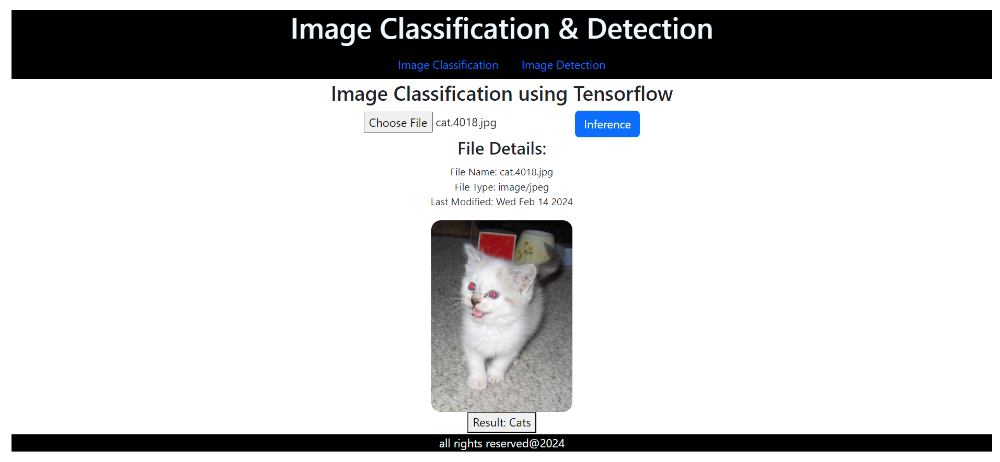

# Tensorflow Interfernce with Web Front End

- Cat or Dogs?

# Training [For Image Classification]

## Terminology

- One Epoch is when an ENTIRE dataset is passed forward and backward through the neural network only ONCE
- Total number of training examples present in a single batch.
- Iterations is the number of batches needed to complete one epoch.
- Gradient Descend = It is an iterative optimization algorithm used in machine learning to find the best results (minima of a curve). Gradient means the rate of inclination or declination of a slope.
- The learning rate is a tuning parameter in an optimization algorithm that determines the step size at each iteration while moving toward a minimum of a loss function.

## setup environment
- set TF_ENABLE_ONEDNN_OPTS=0
- get %TF_ENABLE_ONEDNN_OPTS%
- python training.py

## model
_________________________________________________________________
 Layer (type)                Output Shape              Param #
=================================================================
 conv2d (Conv2D)             (None, 150, 150, 256)     19456

 max_pooling2d (MaxPooling2  (None, 75, 75, 256)       0
 D)

 dropout (Dropout)           (None, 75, 75, 256)       0

 conv2d_1 (Conv2D)           (None, 75, 75, 128)       819328

 max_pooling2d_1 (MaxPoolin  (None, 37, 37, 128)       0
 g2D)

 dropout_1 (Dropout)         (None, 37, 37, 128)       0

 conv2d_2 (Conv2D)           (None, 37, 37, 64)        73792

 max_pooling2d_2 (MaxPoolin  (None, 18, 18, 64)        0
 g2D)

 dropout_2 (Dropout)         (None, 18, 18, 64)        0

 conv2d_3 (Conv2D)           (None, 18, 18, 32)        18464

 max_pooling2d_3 (MaxPoolin  (None, 9, 9, 32)          0
 g2D)

 dropout_3 (Dropout)         (None, 9, 9, 32)          0

 flatten (Flatten)           (None, 2592)              0

 dense (Dense)               (None, 64)                165952

 dense_1 (Dense)             (None, 32)                2080

 dense_2 (Dense)             (None, 3)                 99

=================================================================
Total params: 1099171 (4.19 MB)
Trainable params: 1099171 (4.19 MB)
Non-trainable params: 0 (0.00 Byte)
_________________________________________________________________       
63/63 [==============================] - 51s 807ms/step - loss: 0.4739 - accuracy: 0.7715
63/63 [==============================] - 48s 765ms/step       
              precision    recall  f1-score   support

           0       0.76      0.80      0.78      1000
           1       0.79      0.74      0.77      1000

    accuracy                           0.77      2000
   macro avg       0.77      0.77      0.77      2000
weighted avg       0.77      0.77      0.77      2000

## conclusion
- As we have seen, the second CNN model was able to predict the test image correctly with a test accuracy of close to 80%.

- There is still scope for improvement in the test accuracy of the CNN model chosen here. Different architectures and optimizers can be used to build a better food classifier.

- Transfer learning can be applied to the dataset to improve accuracy. You can choose among multiple pre-trained models available in the Keras framework.

- Once the desired performance is achieved from the model, the company can use it to classify different images being uploaded to the website.

- We can further try to improve the performance of the CNN model by using some of the below techniques and see if you can increase accuracy:

- We can try hyperparameter tuning for some of the hyperparameters like the number of convolutional blocks, the number of filters in each Conv2D layer, filter size, activation function, adding/removing dropout layers, changing the dropout ratio, etc.

- Data Augmentation might help to make the model more robust and invariant toward different orientations.

# Inference
- python inferencemgr.py

# Api server
- uvicorn api_server:app --reload

# calling apis
- python upload-image-request.pys

# starting frontend
- cd front-end/react-file-upload
- npm start

# references

[Error] (https://stackoverflow.com/questions/67553391/input-0-of-layer-conv2d-is-incompatible-with-layer-expected-axis-1-of-input-sh)